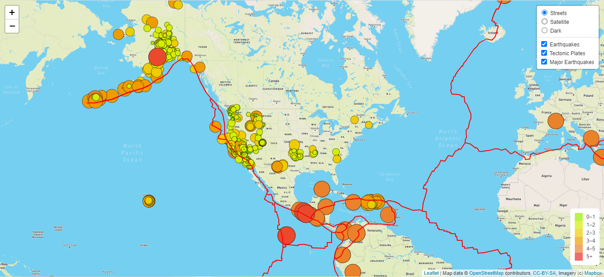
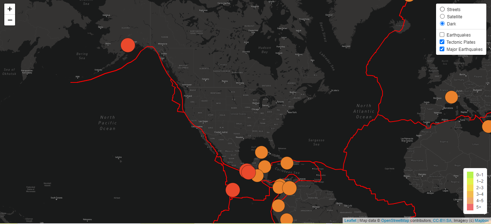
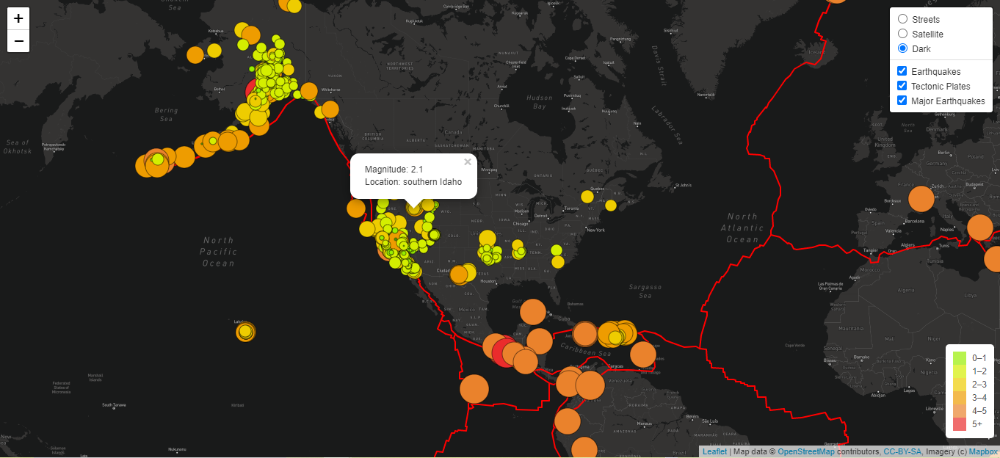

# Mapping Earthquakes

## Overview of the analysis
The goal of this project is to create an earthquake map with three different maps (streets, satellite, dark) and three overlays:
- Earthquakes,
- Tectonic Plates;
- Major Earthquakes. 

All should be done using knowledge of JavaScript, Leaflet.js, and geoJSON data.

## Results
As a result of the project the map was created with default streets tile layer and three overlays. It is possible to change the view of the map by choosing one of three tile layers. By default, all three overlays are visible on the map but the end user can choose any combination of them or remove all of them from the map.

Using a `bindPopup()` method and `onEachFeature()` callback function the popups for the magnitude and location were added from each GeoJSON object. So simply clicking on any earthquake circle marker it is easy to get this information.

Colors of circle markers and lines are well distinguishable on any background. Color and radius of each circle marker depends on the earthquake magnitude of a particular GeoJSON object.

There's also a legend created that shows the color range of the earthquakes where the color depends on the magnitude of the earthquake.

## Summary

Below is the view of a created final map:

End user can change view layout - there are three options. And also, can choose any combination of three overlays:

There are popups for the magnitude and location for each GeoJSON object:

